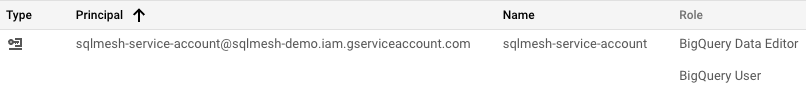
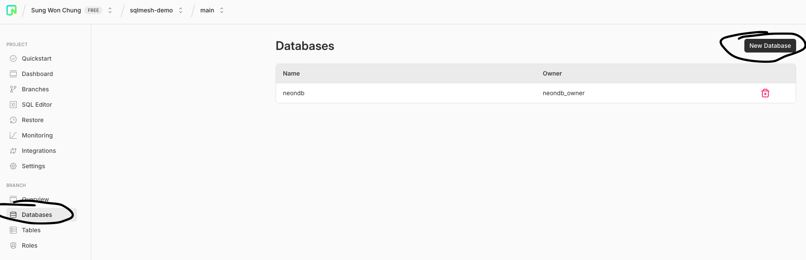

<h2 align="center">

 Demos

</h2>

This is a simple, loveable, and complete SQLMesh demo project with the goal of running multiple, realistic scenarios very fast. 

This repo is going to try something a bit novel compared to your standard demo projects. I'll take you through different stories that illustrate the data engineering workflow. It'll engage your inner dialogue along with look and feel of the development experience. The hope is for you to better internalize and translate these stories to your own reality. Don't worry, these stories won't be too long-winded!

This is intentionally similar to what people may have experienced when I created this github repo at dbt Labs: [here](https://github.com/dbt-labs/jaffle_shop_duckdb)


## Basic Setup

What you'll be using:

- SQLMesh: transformation framework
- BigQuery: data warehouse to run transforms against
- DuckDB: local development testing
- Postgres: Store SQLMesh metadata
- SQLGlot: Python macros that compile to SQL
- pytest: test Python macros

<details>

**Setup your virtual environment for SQLMesh:**

```bash
git clone https://github.com/TobikoData/sqlmesh-demos.git # clone the repo
cd sqlmesh-demos # go to the root directory
python -m venv venv # create virtual environment
source venv/bin/activate # activate it
pip install -r requirements.txt # install dependencies
source venv/bin/activate # reactivate virtual environment
```

**Setup your BigQuery Service Account:**



1. Create a service account following these instructions: [here](https://cloud.google.com/iam/docs/service-accounts-create)
2. Add permissions: `BigQuery Data Editor`, `BigQuery User`
3. Download the service account json file
4. Copy the contents of the service account file to your clipboard
5. Export the credentials as an environment variable in your terminal: 

`export GOOGLE_CREDENTIALS=<your-service-account-key-contents>`

**Setup your Postgres Database:**

1. Sign up for a free Neon account: [here](https://neon.tech/)
2. Create a new database named: `sqlmesh_state_demo`

3. Export your environment variables based on the newly created database connection string


```bash
# examples based on the image above
export SQLMESH_STATE_HOST=ep-purple-heart-a6mqlep8.us-west-2.aws.neon.tech
export SQLMESH_STATE_USERNAME=<your-neon-username>
export SQLMESH_STATE_PASSWORD=<your-password-blurred-in-the-image>
```

**Verify SQLMesh can connect to BigQuery and Postgres:**

```bash
sqlmesh info # print info about a SQLMesh project

# expected output
Models: 15
Macros: 1
Data warehouse connection succeeded
State backend connection succeeded
Test connection succeeded
```

</details>

## Story #1

How do I run SQLMesh as fast as possible and get the general look and feel?

Run this command and watch the demo video!

```bash
sqlmesh plan # follow the instructions in the CLI prompt
```

More details on the demo video will be added soon!


### Credits

Portions of this project are modifications based on work created and shared by dbt Labs and used according to terms described in the Apache License, Version 2.0. For the original work and its license, see: [here](https://github.com/dbt-labs/jaffle_shop_duckdb?tab=Apache-2.0-1-ov-file#readme)
