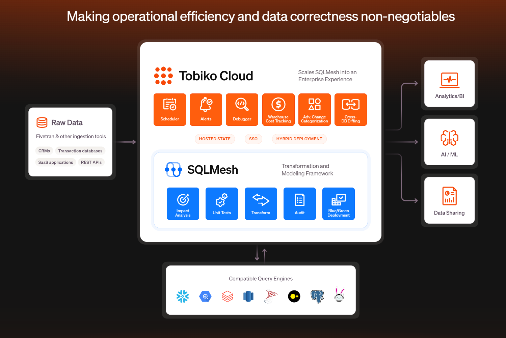

<h2 align="center">



</h2>

> Extract, Load, Transform (ELT) Example Data Architecture

This is a simple, loveable, and complete Tobiko Cloud demo project with the goal of running multiple, realistic scenarios very fast. 

This repo is going to try something a bit novel compared to your standard demo projects. I'll take you through different stories that illustrate the data engineering workflow. It'll engage your inner dialogue along with look and feel of the development experience. The hope is for you to better internalize and translate these stories to your own reality. Don't worry, these stories won't be too long-winded!

This is intentionally similar to what people may have experienced when I created this github repo at dbt Labs: [here](https://github.com/dbt-labs/jaffle_shop_duckdb)


## Basic Setup

What you'll be using:

- Tobiko Cloud: state backend (uses postgres) and observability
- SQLMesh: transformation framework
- SQLGlot: Python macros that compile to SQL
- pytest: test Python macros
- BigQuery: data warehouse to run transforms against
- DuckDB: local development testing

<details>

**Setup your virtual environment for SQLMesh:**

```bash
git clone https://github.com/TobikoData/tobiko-cloud-demo.git # clone the repo
cd tobiko-cloud-demo # go to the root directory
make dev-install # virtual environment setup
```

**Setup your BigQuery Service Account:**


1. Create a service account following these instructions: [here](https://cloud.google.com/iam/docs/service-accounts-create)
2. Add permissions: `BigQuery Data Editor`, `BigQuery User`
3. Download the service account json file
4. Copy the contents of the service account file to your clipboard
5. Export the credentials as an environment variable in your terminal: 

`export GOOGLE_SQLMESH_CREDENTIALS=<your-service-account-key-contents>`

**Setup your Tobiko Cloud State Connection:**

1. Work with Tobiko to get your Tobiko Cloud Token and account url

```bash
# examples based on the image above
export TOBIKO_CLOUD_TOKEN=<TOBIKO_CLOUD_TOKEN>
```

```yaml
# config.yaml gateway example
gateways:
    tobiko_cloud:
        connection:
            type: bigquery
            method: service-account-json
            concurrent_tasks: 5
            register_comments: true
            keyfile_json: {{ env_var('GOOGLE_SQLMESH_CREDENTIALS') }}
            project: sqlmesh-public-demo # TODO: update this
        state_connection:
            type: cloud
            url: https://sqlmesh-prod-enterprise-public-demo-sefz6ezt4q-uc.a.run.app # TODO: replace this url with your own
            token: "{{ env_var('TOBIKO_CLOUD_TOKEN') }}"
```

**Verify SQLMesh can connect to BigQuery and Tobiko Cloud:**

```bash
sqlmesh info # print info about a SQLMesh project

# expected output
Models: 15
Macros: 1
Data warehouse connection succeeded
State backend connection succeeded
Test connection succeeded
```

</details>

## Story #1

Run a SQLMesh error simulation for raw data schema evolution.

<details>

```python
# run all these from the root directory

# rename a raw table column, the table should already exist
python demo_scripts/main.py rename-column --old event_name --new named_events

# expected output
# Original Schema:
#   event_id: STRING
#   event_name: STRING
#   event_timestamp: TIMESTAMP
#   user_id: STRING

# Column 'event_name' has been renamed to 'named_events' in table sqlmesh-public-demo.tcloud_raw_data.raw_events

# Updated Schema:
#   event_id: STRING
#   named_events: STRING
#   event_timestamp: TIMESTAMP
#   user_id: STRING

# run sqlmesh for the incremental_events.sql model
sqlmesh run --ignore-cron

# expected output
# google.api_core.exceptions.BadRequest: 400 GET https://bigquery.googleapis.com/bigquery/v2/projects/sqlmesh-public-demo/queries/0af1142b-cf71-4dc2-aa56-f60b09af777b?maxResults=0&location=US&prettyPrint=false: Unrecognized name: event_name; Did you mean event_id? at
# [1:254]

# Location: US
# Job ID: 0af1142b-cf71-4dc2-aa56-f60b09af777b

# look at the error within the Tobiko Cloud UI
# https://sqlmesh-prod-enterprise-public-demo-sefz6ezt4q-uc.a.run.app/observer/environments/prod/runs/8ee6076967e342409d321f8c644282fd

# fix the error
# this command defaults to fixing the error, so no need to add options
python demo_scripts/main.py rename-column

# expected output
# Original Schema:
#   event_id: STRING
#   named_events: STRING
#   event_timestamp: TIMESTAMP
#   user_id: STRING

# Column 'named_events' has been renamed to 'event_name' in table sqlmesh-public-demo.tcloud_raw_data.raw_events

# Updated Schema:
#   event_id: STRING
#   event_name: STRING
#   event_timestamp: TIMESTAMP
#   user_id: STRING

# rerun sqlmesh for the incremental_events.sql model
sqlmesh run --ignore-cron

# expected output
# [1/1] tcloud_demo.incremental_events_allow_partials evaluated in 7.76s
# [1/1] tcloud_demo.incremental_events evaluated in 13.76s
# Evaluating models ━━━━━━━━━━━━━━━━━━━━━━━━━━━━━━━━━━━━━━━━ 100.0% • 2/2 • 0:00:13                                                                                                                                                                                      

# All model batches have been executed successfully

# Run finished for environment 'prod'
```
</details>

### Airflow Preview Setup
1. Download the astro CLI and Docker Desktop
2. git clone the sqlmesh-enterprise repo into the root directory
3. add `_version.py` contents (`__version__ = version = '202450.7.0+85e4d5d'`) to this path: `sqlmesh-enterprise/sqlmesh_enterprise/_version.py`
4. run `astro dev start`

### Credits

Portions of this project are modifications based on work created and shared by dbt Labs and used according to terms described in the Apache License, Version 2.0. For the original work and its license, see: [here](https://github.com/dbt-labs/jaffle_shop_duckdb?tab=Apache-2.0-1-ov-file#readme)
